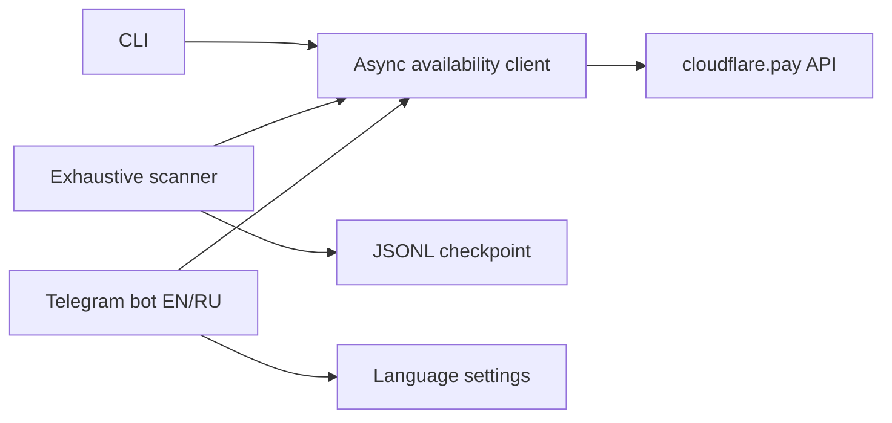

# Architecture

`CloudflareWalletClient` is the single source of truth for availability classification. A handle is
available only when the API returns `available: true`. `TAG_TAKEN` and `RESERVED_TAG` are separate
unavailable states. Redirecting to the reservation page is not treated as proof of availability.

The CLI writes one file per status. The exhaustive scanner appends every result to a JSONL checkpoint
and retries only missing or failed handles after a restart. The bot reuses the same client and stores
only Telegram user language preferences in SQLite.
